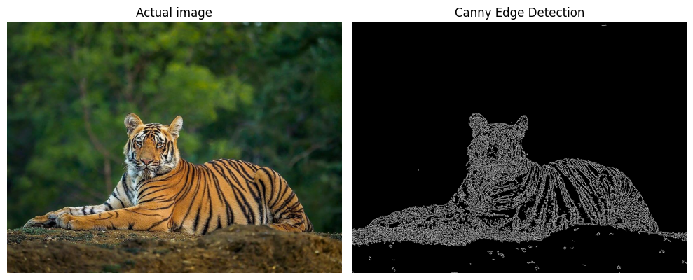

# Computer Vision Utilities in Python

This repository contains a collection of utility functions for various computer vision tasks using Python's OpenCV and other relevant libraries. Each utility is designed to perform a specific task, accompanied by test scripts to demonstrate its functionality.

## Table of Contents

- [Installation](#installation)
- [Utilities](#utilities)
  - [Canny Edge Detection](#canny-edge-detection)
  - [Find Contours](#find-contours)
  - [Background Capture](#background-capture)
  - [Color Detection](#color-detection)
  - [Mask Generation](#mask-generation)
  - [Text Recognition (OCR)](#text-recognition-ocr)
  - [Face Detection](#face-detection)
- [Usage](#usage)
- [Output](#output)
- [Contributing](#contributing)

## Installation

1. **Clone the repository:**

   ```bash
   git clone https://github.com/yourusername/computer-vision-utilities.git
   cd computer-vision-utilities
   ```

2. **Create and activate a virtual environment (optional but recommended):**

  ```bash
  python -m venv venv
  source venv/bin/activate
```

3. **Install the required dependencies:**

```bash
pip install -r requirements.txt
```

Note: Ensure that you have the necessary system dependencies for OpenCV and Tesseract installed. For detailed instructions, refer to the OpenCV installation guide and the Tesseract installation guide.

## Utilities
### **Canny Edge Detection**
* Description: Applies the Canny edge detection algorithm to an input image to highlight edges.
* Implementation: utils/canny_edge_detection.py
* Test Script: tests/test_canny_edge_detection.py

### **Find Contours**
* Description: Identifies and retrieves contours from an input image.
* Implementation: utils/find_contours.py
* Test Script: tests/test_find_contours.py

### **Background Capture**
* Description: Captures and stores the background from an input image, excluding foreground objects.
* Implementation: utils/background_capture.py
* Test Script: tests/test_background_capture.py

### **Color Detection**
* Description: Detects specified colors within an input image.
* Implementation: utils/color_detection.py
* Test Script: tests/test_color_detection.py

### **Mask Generation**
* Description: Generates a binary mask from an input image based on specified criteria.
* Implementation: utils/mask_generation.py
* Test Script: tests/test_mask_generation.py

### **Text Recognition (OCR)**
* Description: Performs Optical Character Recognition (OCR) on an input image containing handwritten or printed text using Tesseract.
* Implementation: utils/text_recognition.py
* Test Script: tests/test_text_recognition.py

### **Face Detection**
* Description: Detects human faces in an input image and returns their locations and encodings.
* Implementation: utils/face_recognition.py
* Test Script: tests/test_face_recognition.py

## Usage
Each utility function is accompanied by a test script located in the tests directory. To run a test script:

python -m test.<test script name without py extension>
For example, to test the Canny Edge Detection utility:
```bash
python -m test.test_text_recognition
```
Ensure that the input images required for testing are placed in the appropriate directory or update the file paths in the test scripts accordingly.

## Output
* Output for edge detection utility:




## Contributing
Contributions are welcome! If you have suggestions for improvements or additional utilities, please fork the repository and submit a pull request. For major changes, open an issue first to discuss your ideas.

1. Fork the Project
2. Create your Feature Branch (git checkout -b feature/featureBranch)
3. Commit your Changes (git commit -m 'Add some featureBranch')
4. Push to the Branch (git push origin feature/featureBranch)
5. Open a Pull Request
